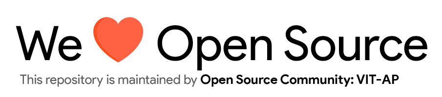

# AutoRoleBot

    
     Automatically assign roles to users for ease of event management on Discord.

---

## Table of Contents

-   [Motivation](#Motivation)
-   [Installation](#Installation)
-   [Usage](#Usage)
    -   [Bot Commands](#Various-bot-commands)
-   [Contributing](#Contributing)
-   [License](#License)

## Motivation

Over the last few years of event management on an online medium, Discord was our go to platform for ease of communication with the participants.
However, it was taxing to assign roles for each member of a team for each event. Especially when the event is large like WebHunt with over 200+ Participants. \
And so, we decided to create a bot that would automate the task of providing dedicated roles to team members.

## Installation

For the latest stable version, head to [Releases](https://github.com/Open-Source-Community-VIT-AP/AutoRoleBot/releases).

Download and extract the source code.

As an alternative, you could also clone the repository using,

<pre>
git clone https://github.com/Open-Source-Community-VIT-AP/AutoRoleBot
</pre>

Once you have the source code, create a virtual environment using the following command,
`python3 -m venv venv`

Enter the virtual environment using `venv/Scripts/Activate on your terminal`

Once you are inside the virtual environment install dependancies using `pip install -r requirements.txt`.

Finally, create a discord token. For more information, checkout this article https://www.writebots.com/discord-bot-token/.

You are all set to start using the application now.

## Usage

<!--- Provide instructions on how to use the application after installing it --->

To launch the file, use the following command, `python3 main.py` inside the `src` file.

Once the bot is online on your discord server, you are all set to use it's various commands on the server.

** Note: ** Make sure to create a role called `AutoRole Admin` and assign it to the people who will be using the bot.

Setup your `participants.csv` file in the `data` folder. Make sure to follow the exact same format as the example file.

### Various bot commands

-   `==addrole` - Adds roles to all the users present in the `participants.csv` file and joined the Discord Server.
-   `==usersleft` - Provides you a list of users that are yet to join the Discord server.

## Contributing

To contribute to AutoRoleBot, fork the repository, create a new branch and send us a pull request. Make sure you read [CONTRIBUTING.md](https://github.com/Open-Source-Community-VIT-AP/AutoRoleBot/blob/master/.github/CONTRIBUTING.md) before sending us Pull requests.

Also, thanks for contributing to Open-source!

## License

AutoRoleBot is under The MIT License. Read the [LICENSE](https://github.com/Open-Source-Community-VIT-AP/AutoRoleBot/blob/master/LICENSE) file for more information.

---

